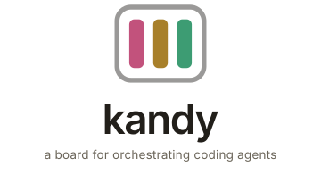

<div align="center">

<picture>
  <source media="(prefers-color-scheme: dark)" srcset="apps/docs/public/brand/kandy-dark.svg">
  
</picture>

</div>

<br>

Sticky notes are units of agent work. Write a note, assign it to an agent
(Claude Code, Codex, and more to come), and it runs — isolated in its own git
worktree, streaming its transcript back to whichever client you're looking at.
You can steer it mid-run. When it lands, the note carries a branch and a diff
you review without leaving the board.

**Why a board.** Every terminal agent gives you one conversation. The real job is
"here are nine things, go" — and the two questions that matter are *what's in
flight* and *what's blocked on me*. A board answers both at a glance. A scrollback
answers neither.

**Status:** pre-alpha, but it runs real work. kandy is developed using kandy.


## What works

- **Boards** — point one at a git repo; paths are validated as you type.
- **Notes** — a prompt, an agent, and a lifecycle: draft → queued → running →
  review → done. Cards move between lanes by themselves as status changes.
- **Isolation** — every note runs in its own `git worktree` on its own branch.
  Several agents work the same repo at once without seeing each other's writes,
  and your working tree is never touched.
- **Live transcript** — what the agent said, what it ran, what it was refused.
- **Steering** — send a message to a running agent mid-turn, or queue a follow-up
  that resumes its session in the same worktree.
- **Review** — a diff against the commit it branched from, then merge (`--no-ff`)
  or discard. Conflicts are reported, never guessed at.
- **Permissions** — per note: *repo only* (edit files, most shell refused) or
  *full access* (run anything). Your call, stated plainly, never defaulted up.

## Architecture

One background **server process** owns all state and all agent execution.
Clients are thin and interchangeable.

```
                    ┌──────────────────────────┐
   HTTP + SSE  ┌────┤  kandy server (daemon)   │
               │    │  SQLite event log        │
               │    │  worktree manager        │
               │    │  agent adapters ─┬─► claude
               │    └──────────────────┼─► codex
               │                       └─► …
   ┌───────────┴──────┬─────────────────┐
   │                  │                 │
 web (React)       tui (live)      desktop (later)
```

Every state change is an append to an immutable log; views are projections.
Read [`docs/01-architecture.md`](docs/01-architecture.md) for the reasoning, and
[`docs/09-open-questions.md`](docs/09-open-questions.md) for what's still unsolved.

## Layout

| Path | What |
| --- | --- |
| `apps/server` | The daemon. Owns state, runs agents, serves the API. |
| `apps/web` | React board. The primary client. |
| `apps/tui` | Terminal client. Live board view over the same SSE stream. |
| `packages/core` | Domain types, event schemas, and the one reducer everything projects with. |
| `packages/client` | Typed client for the server API. |
| `apps/docs` | The documentation site (VitePress). `pnpm --filter @kandy/docs dev` |

## Running it

```sh
pnpm install
pnpm build
node apps/server/dist/cli.js serve      # board + API on http://127.0.0.1:4477
```

That is the whole thing: the daemon serves the built board itself, so there is
one process to run and one URL to open.

`serve` takes `--port N` and `--slots N` (how many agents may run at once).
Pass `--json` to print a single JSON object once the daemon is listening, with
`port`, `dbPath`, and `slots` fields, for example:
`{"port":4477,"dbPath":"/home/user/.local/state/kandy/kandy.db","slots":4}`.

```sh
pnpm --filter @kandy/tui dev            # watch the same board from a terminal
pnpm --filter @kandy/web dev            # work ON the UI, with HMR, on :5477
```

Then open the board, create one against a repo, and write a note.

Requires Node >= 22, pnpm, and at least one agent CLI installed and logged in
(`claude` or `codex`). kandy never reads or stores your credentials — it spawns
the CLI you already authenticated, and the child inherits it.

## Tests

```sh
pnpm test      # 85 tests across core and server
```

They cover the reducer's state machine, cost provenance, both agent adapters
parsed against their real captured output, pricing and model menus, projections
and replay, attachment path safety, and worktree isolation against an actual
git repository.

## Using kandy from another agent

`.claude/skills/kandy/SKILL.md` lets Claude Code (or anything that reads skill
files) queue work onto a board rather than doing it inline. Copy it to
`~/.claude/skills/kandy/` to have it everywhere.

## Docs

| | |
| --- | --- |
| [Vision](docs/00-vision.md) | What this is and what we're betting on |
| [Architecture](docs/01-architecture.md) | Daemon, transport, event log, steering |
| [Data model](docs/02-data-model.md) | Notes, runs, events, ordering |
| [Worktrees](docs/03-worktrees.md) | The isolation mechanism, and what will bite |
| [Protocol](docs/04-protocol.md) | HTTP + SSE surface |
| [Agents & auth](docs/05-agent-auth.md) | Adapters, credentials, and the policy risk |
| [Landscape](docs/06-landscape.md) | herdr, t3code, opencode, pi — read from source |
| [Sync](docs/07-sync.md) | Why there's none yet, and what it'll be |
| [Roadmap](docs/08-roadmap.md) | What's next, in order |
| [Open questions](docs/09-open-questions.md) | Honest list of what's unresolved |
| [Interface](docs/10-interface.md) | Design rules, and a direction we reverted |
| [Going multiplayer](docs/11-going-multiplayer.md) | Sharing a note with a teammate — the bet, kept as notes |
| [Spike: git share](docs/12-spike-git-share.md) | Two laptops over an orphan branch — what held, what didn't |

## Talking to the daemon

The daemon mints a random token on first start at `$XDG_STATE_HOME/kandy/token`
(`~/.local/state/kandy/token` by default), readable only by you. Reads over
loopback stay open; every write sends it as an `Authorization: Bearer` header.
Tokens in query strings are not accepted, and cross-origin requests are
rejected outright — the dev UI goes through Vite's `/api` proxy on port 5477.

The web client fetches its token through a same-origin bootstrap request and
keeps it in memory, never in storage or a URL. Anything else talking to the
API should read the token file and pass it as `KandyClient({ token })`.
